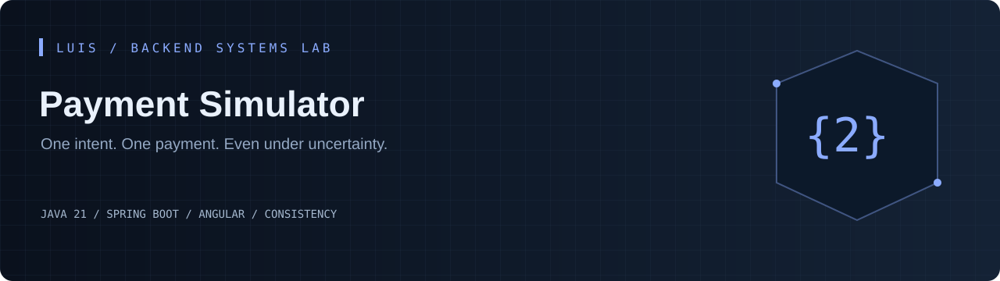
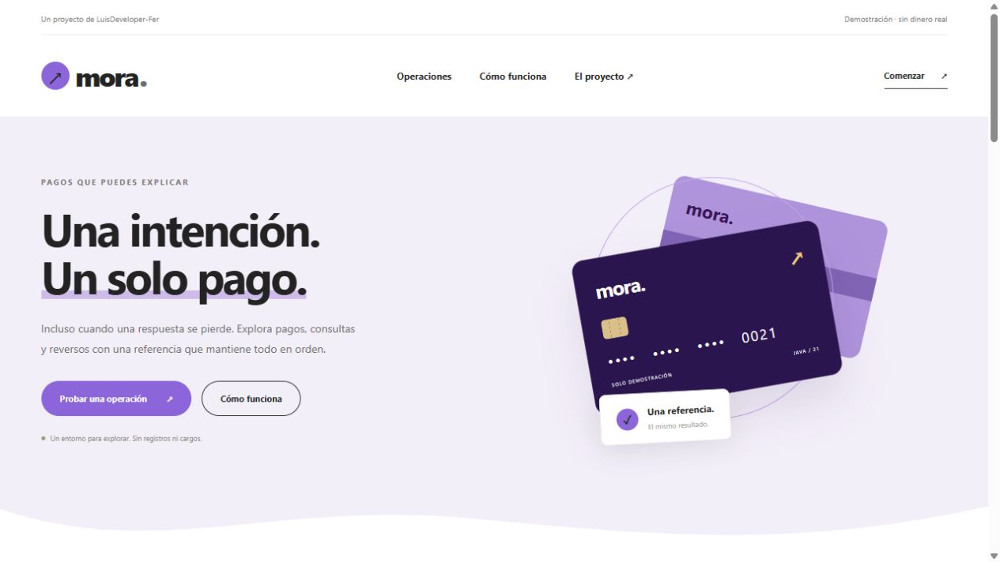
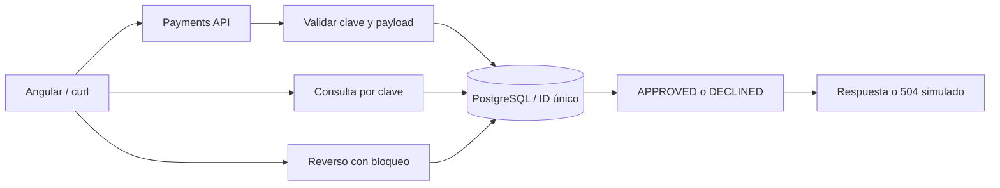

[](https://github.com/LuisDeveloper-Fer/payment-simulator/actions/workflows/ci.yml)


[](LICENSE)

**Una respuesta perdida puede causar que el cliente repita un pago ya procesado. El simulador reproduce esa incertidumbre y la resuelve con una identidad persistente y un estado consultable.**

Proyecto independiente del [Backend Systems Lab de Luis](https://github.com/LuisDeveloper-Fer). Código y datos de demostración, sin información propietaria ni dinero real.

## En 60 segundos

- Idempotency-Key persistente y comparación de payload
- Restricción única para resolver inserciones concurrentes
- Reversos con bloqueo de fila y transición validada
- APPROVED, DECLINED y LOST_RESPONSE; códigos 00 / 51
- Prueba de ocho solicitudes concurrentes con una clave

**Experimento principal:** Usa LOST_RESPONSE: el servicio guarda APPROVED y devuelve 504. Consulta por clave y repite el mismo request: obtendrás el mismo pago. Después solicita un reverso.

## Probar en Internet

[**Abrir demo interactiva**](https://luisdeveloper-fer.github.io/payment-simulator/) · Simulación en navegador, sin backend Java. [Alcance](docs/PUBLIC-DEMO.md).

## Vista previa



Interfaz con formularios de operación, estado consultable y detalle técnico desplegable. La imagen muestra la portada; para ejecutar el flujo completo sigue las instrucciones de abajo.

## Ejecutar

Requisitos: **JDK 21**, Maven 3.9+, Node 22.12+ para Angular y Docker Compose para el stack completo. [Compatibilidad de Spring Boot](https://docs.spring.io/spring-boot/system-requirements.html) · [Compatibilidad de Angular](https://angular.dev/reference/versions).

```bash
git clone https://github.com/LuisDeveloper-Fer/payment-simulator.git
cd payment-simulator
mvn clean package
docker compose up --build
```

| Componente | Dirección |
| --- | --- |
| Angular | http://localhost:4200 |
| API | http://localhost:8080 |

Puertos publicados solo en loopback. Ejecuta un laboratorio a la vez o cambia API_PORT/UI_PORT en el entorno.

### Desarrollo local

```bash
mvn spring-boot:run
# otra terminal:
cd frontend
npm ci
npm start
```

Localmente usa H2 en memoria para arrancar y probar sin dependencias. **Compose usa PostgreSQL 17 con volumen persistente**. Configura DB_URL, DB_USER y DB_PASSWORD para otro datasource. Hibernate ddl-auto=update simplifica el laboratorio; producción requiere migraciones versionadas.

## Arquitectura



La base de datos arbitra la idempotencia. El insert corre en su propia transacción; ante una carrera se consulta al ganador después del rollback. El reverso bloquea la fila, permite APPROVED → REVERSED y conserva el resultado al repetirse.

[Decisión técnica](docs/adr/001-design.md) · [Contrato de API](docs/api.md) · [Guion de entrevista](docs/interview.md)

## Primer request

```bash
curl -i -X POST http://localhost:8080/api/payments \
  -H 'Content-Type: application/json' \
  -H 'Idempotency-Key: payment-demo-001' \
  --data '{"amount":125.5,"currency":"PEN","scenario":"LOST_RESPONSE"}'
```

Ejemplo de estado consultado después del 504:

```json
{
  "id": "payment-demo-001",
  "status": "APPROVED",
  "amount": 125.5,
  "currency": "PEN",
  "responseCode": "00"
}
```

IDs y fechas cambian en cada ejecución. [Colección curl](examples/requests.sh) · [Payload JSON](examples/request.json).

## Endpoints

| Método | Ruta | Resultado |
| --- | --- | --- |
| POST | `/api/payments` | 201 nuevo; 200 replay; 409 conflicto; 504 simulado |
| GET | `/api/payments/{key}` | Resultado durable |
| GET | `/api/payments` | Últimos 50 pagos |
| POST | `/api/payments/{key}/reversals` | Reverso idempotente; 409 si DECLINED |

## Pruebas

```bash
mvn clean package
cd frontend && npm ci && npm run build
```

Concurrencia con ocho solicitudes produce una creación; conflicto de payload; reverso repetible y rechazo del reverso de un pago declinado. Las pruebas no necesitan Docker y usan H2; no sustituyen una validación sobre PostgreSQL. CI compila Java y Angular. [Evidencia y límites de validación](docs/VALIDATION.md).

## Estructura

```text
src/main/java/dev/portfolio/
  api/              Contratos HTTP y validación
  application/      Casos de uso
  domain/           Estado y reglas
  infrastructure/   Clientes o repositorios
src/test/           Pruebas
frontend/           Angular standalone
ops/                Entorno de ejecución
docs/               Decisiones y guía técnica
examples/           Requests reproducibles
```

## Alcance honesto

No mueve dinero ni implementa contabilidad. LOST_RESPONSE devuelve un 504 después del commit: modela incertidumbre, no un timeout TCP. La idempotencia dura mientras exista el registro. Las pruebas locales H2 no garantizan por sí solas el comportamiento en PostgreSQL.

API de laboratorio sin autenticación, enlazada localmente. [secure-api-demo](https://github.com/LuisDeveloper-Fer/secure-api-demo) aborda seguridad por separado.

## Para una entrevista

1. Reproduce el experimento principal y explica el resultado.
2. Identifica dónde termina cada transacción y qué garantiza.
3. Explica qué ocurre ante un reinicio o una solicitud duplicada.
4. Justifica qué cambiarías para operar varias instancias.

---

**LuisDeveloper-Fer** · Java Backend Developer · [Los seis laboratorios](https://github.com/LuisDeveloper-Fer) · [MIT](LICENSE)
